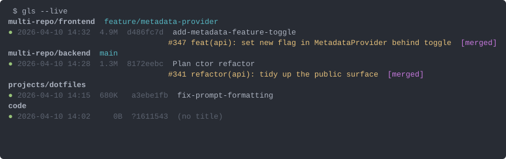

# gwt-ls

Inspect git worktrees and the Claude Code sessions that ran in them, plus snapshot/restore your open Claude tabs across a reboot.

A single-file Python tool. Pipe-friendly, `gh`-aware, read-only by default (the tab-spawning actions are explicit).

## Install

```sh
git clone https://github.com/FelixDombek-TomTom/gwt-ls.git
chmod +x gwt-ls/gwt-ls.py
ln -s "$(pwd)/gwt-ls/gwt-ls.py" ~/.local/bin/gls   # or whatever short name you prefer
```

Requires Python 3.10+, `git`, and `gh` (for PR titles + status badges; everything else works without it).

## Workflows

### See what's in this directory

`gls` from inside a git repo lists that repo's worktrees with branch + latest-session-per-worktree. From a folder of repos it groups them. Non-git folders that have run Claude sessions still appear with a `(non-git)` row. `→` marks the worktree containing your `$PWD`.


Bump the session count with `-n N` (default 1) or get all of them with `-a`. `-n 0` collapses each row to a one-line summary.

### See what you did everywhere, newest first

`gls -c` is a flat feed of the most recent Claude sessions across every worktree on the machine. Defaults to the top 10. Pass a `PATH` to restrict to sessions whose recorded `cwd` lives under it.


`gls -c ~/code/foo`, `gls -c -n 20`, `gls -c -a`. Add `--include-tmp` to also show `/tmp`-rooted throwaways.

### See what's running right now

`gls --live` lists Claude sessions that have a process still alive. Each row gets a green `● ` bullet. Attribution uses `~/.claude/active/<pid>.json` when populated (see "Hooks" below); falls back to a `/proc` + JSONL-birth-time heuristic for sessions started before hooks were installed.



The 8-char UUID column on every detail row is what you paste into `gls -r`.

### Resume a specific session from anywhere

```sh
gls -r d486fc7d                 # resolve prefix → cd to its workdir → exec `claude -r <full-uuid>`
gls -r d486fc7d "say hi"        # also pass an initial prompt
gls -r d4                       # if unique, fine; otherwise prints candidates and exits 2
gls -r d486fc7d --dry-run       # show the chdir + command without running
gls -r d486fc7d --new-tab       # spawn-detached in a new gnome-terminal tab instead of in-place
```

`--new-tab` is the key knob for the "from any running claude, open another session in a new tab without inheriting my lifetime" case. The current shell / claude stays alive; the new tab is parented under `gnome-terminal-server`.

### Snapshot & restore your open tabs across a reboot

```sh
gls --save-tabs                   # → ~/.claude/tabs.json
gls --restore-tabs                # → spawn one tab per saved entry
gls --restore-tabs --dry-run      # print would-spawn commands without running
```

Combine with a 5-minute cron snapshot so reboot recovery always has a recent manifest:

```cron
*/5 * * * * /home/<you>/.local/bin/gls --save-tabs >/dev/null 2>&1
```

**How the spawn works.** The default opener invokes `gnome-terminal --tab` with `env GLS_CLAUDE_RESUME_UUID=<uuid> $SHELL` — your full rc chain runs (so claude gets your real interactive env: PATH, mise, tokens, aliases), and a tiny snippet sourced at the end of your rc launches claude with the resume uuid. To enable this, add one line to the end of your `~/.zshrc` (or `~/.bashrc`):

```sh
[ -r "$HOME/code/my/gwt-ls/shell/gls-autolaunch.sh" ] && . "$HOME/code/my/gwt-ls/shell/gls-autolaunch.sh"
```

The snippet is a few POSIX-shell lines (see [shell/gls-autolaunch.sh](shell/gls-autolaunch.sh)): if `GLS_CLAUDE_RESUME_UUID` is set, it unsets it and runs `claude -r <uuid>`. Otherwise it's a no-op, so a normal tab still behaves normally. After claude exits you stay in your interactive shell.

**Other terminals.** Override via `$GLS_TAB_OPENER`. The old templated form is still supported (`{cwd}`, `{cmd}`, `{uuid}` placeholders):

```sh
export GLS_TAB_OPENER="kitten @ launch --type=os-window --cwd {cwd} bash -ic '{cmd}; exec bash'"
```

`{cwd}` is shell-quoted; `{cmd}` is `claude -r <uuid>` or plain `claude`.

### Drill into one session

Add `-x` to any view to expose, under each detail row: the session's recorded `gitBranch` (+ `@ subdir` when a non-git parent dir launched the session), the session slug and full UUID, and the most recent user prompt.


### Machine-readable output

`gls --json` emits the same data as JSON. `mode` is `folder`, `repo`, `claude`, or `live`. Sessions include `pr_state`, `pr_ci`, `slug`, `git_branch`, `last_cwd`, `agent_name`, `is_live`, `live_pid`. Pipe through `jq` for anything more specific.

### Offline / instant rendering

`gls --no-pr-titles` skips all `gh pr view` calls — PR badges and titles disappear, only `#NUM` stays. Use when on a plane or for sub-second rendering. `--no-color` forces plain text even on a TTY.

## Hooks (recommended for `--live`)

Without hooks, `--live` attribution works ~90% of the time via the `/proc` + JSONL-birth heuristic. With hooks installed, it's exact. Wire two scripts into Claude Code's hook system:

- A `SessionStart` hook that writes `~/.claude/active/<pid>.json` containing `{uuid, cwd, pid, started_at}`.
- A `SessionEnd` hook that removes it.

Sample scripts and the `~/.claude/settings.json` entries live in [hooks/](hooks/) (or just inline them following Claude Code's hook config format).

## Flag reference

| flag | purpose |
|---|---|
| `gls [PATH]` | folder or repo mode (default). `PATH` defaults to `$PWD`. |
| `-n N`, `--num N` | detail lines per worktree. Default 1 (or 10 in `-c`). `-n 0` to suppress. |
| `-a`, `--all` | show all sessions (overrides `-n`). |
| `-c`, `--claude` | flat feed of latest sessions across everything. Optional `PATH` filter. |
| `--include-tmp` | in `-c`, don't skip `/tmp` and `/var/tmp` sessions. |
| `-x`, `--extras` | add slug+uuid+branch+last-prompt rows under each detail. |
| `-r PREFIX`, `--resume PREFIX` | chdir + `claude -r <full-uuid>` by short UUID prefix. Trailing positional is the initial prompt. |
| `--new-tab` | (with `-r`) spawn-detached in a new tab instead of in-place exec. |
| `--dry-run` | (with `-r` or `--restore-tabs`) print the would-be commands. |
| `--live` | list currently running Claude sessions. |
| `--save-tabs [PATH]` | snapshot live set to PATH (default `~/.claude/tabs.json`). |
| `--restore-tabs [PATH]` | spawn one tab per entry in PATH. |
| `--no-pr-titles` | skip `gh` lookups (offline-safe). |
| `--json` | structured output. |
| `--no-color` | disable ANSI. |

## Notes

- Claude session JSONLs live at `~/.claude/projects/<encoded-cwd>/<uuid>.jsonl`. The encoding is `/` and `.` → `-`. gls reads these directly.
- PR titles + statuses come from `gh pr view --json title,state,isDraft,statusCheckRollup,reviewDecision`, fetched in parallel and patched into each row progressively on a TTY.
- All listing modes are read-only. Tab-spawning (`-r --new-tab`, `--restore-tabs`) is fire-and-forget via `subprocess.Popen(start_new_session=True)` — the spawned tabs are independent of the launching process.
- **Caveat — `ccc` (Claude Code Container) sessions** aren't yet visible to gls: ccc's Docker mount set doesn't include `~/.claude/projects/`. Add `-v "$HOME/.claude/projects:$HOME/.claude/projects"` to your `ccc.sh` to make those sessions appear in gls listings.
