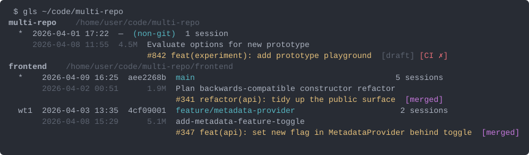
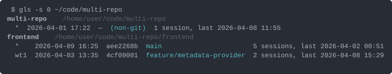
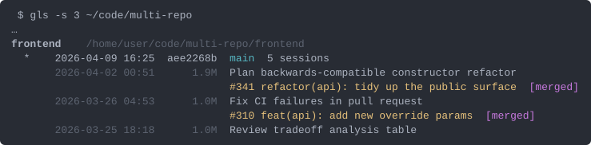
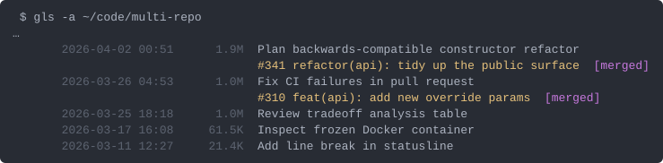
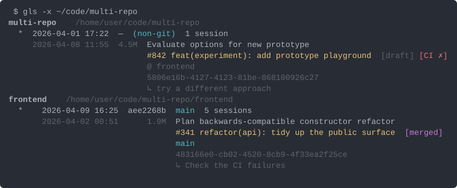
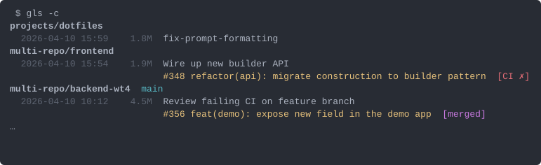
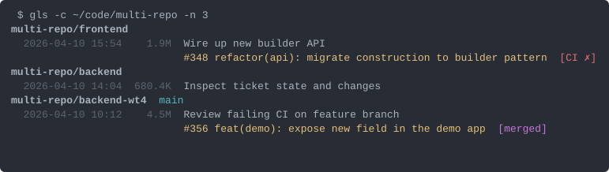
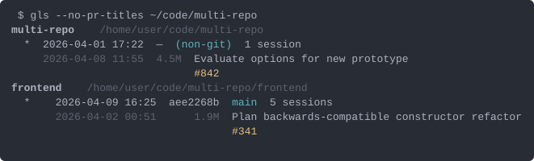

# gwt-ls

Inspect git worktrees alongside the Claude Code sessions that ran in them.

A single-file Python tool. Two complementary views:

- **Worktree view** (default): per-repo blocks listing every worktree, its branch, and the latest Claude session(s), incl. PRs and their status.
- **Latest-sessions feed** (`-c`): list of the most recent Claude sessions across all worktrees, newest first, optionally filtered by dir.

## Install

```sh
git clone https://github.com/FelixDombek-TomTom/gwt-ls.git
chmod +x gwt-ls/gwt-ls.py
ln -s "$(pwd)/gwt-ls/gwt-ls.py" ~/.local/bin/gls   # or whatever short name you prefer
```

Requires Python 3.10+, `git`, and `gh` (for PR titles + badges; everything else degrades gracefully without it).

## Flags & sample output

Examples below use a fictional org `example-org` and a hypothetical `~/code/multi-repo` layout. The screenshots are SVG renders of the real on-TTY output — bold repo headers, dim metadata, cyan branches, yellow PR text, and merge / draft / CI badges in magenta / dim / red.

### `gls [PATH]` — default (folder or repo mode)

When `PATH` (or `$PWD`) is inside a git repo, lists that repo's worktrees. Otherwise scans `PATH`'s children for repos and groups them. Implicitly enables `-s 1`.



The `*` marks the main worktree; secondary worktrees show their suffix (`wt1`, `wt2`…). A `→` prefix marks the worktree containing your current `$PWD`. Non-git folders that ran Claude sessions still appear (with `—  (non-git)` instead of sha/branch).

### `-s N`, `--session-details N` — how many session detail lines

Default `1`. `-s 0` collapses each worktree to a one-line summary with `last <date>`.





### `-a`, `--all` — every session, no cap

Overrides `-s`.



### `-x`, `--extras` — branch from JSONL, full uuid, slug, last prompt

Adds three indented lines beneath each detail row. Useful when a session was started in a parent folder and worked in a subdir — the `@ subdir` annotation tells you which child repo it touched.



### `-c`, `--claude` — latest Claude sessions across everything

A flat feed of the most recent sessions, regardless of which repo or worktree they belong to. Bumps the default of `-s` to `10`. Combines with `-s N` and `-a`.



With a `PATH`, only sessions whose recorded `cwd` lives under it are kept:



### `--no-pr-titles` — skip the `gh` calls

Faster, offline-safe. Drops PR titles and all status badges; the `#NUM` link stays.



### `--no-color` — disable ANSI

Forces plain output even on a TTY. Useful when piping to a pager or capturing for docs. PR `gh` lookups still happen synchronously and the titles still render — but as plain text, no progressive-fill animation.

### `--json` — machine-readable

`mode` is `"folder"`, `"repo"`, or `"claude"` (with `-c`). Sessions appear flat under `sessions` in claude mode, nested under repos/worktrees in folder/repo mode. All known fields surface, including `pr_state`, `pr_ci`, `slug`, `git_branch`, `last_cwd`, `agent_name`.

```json
{
    "mode": "claude",
    "filter_path": null,
    "sessions": [
        {
            "uuid": "773ed2c6-7240-46bd-964f-0fdef111ada0",
            "mtime": 1780667943.27,
            "size": 1935307,
            "title": "fix-prompt-formatting",
            "last_prompt": "let's run the tests again",
            "pr_number": null,
            "slug": "shimmying-cuddling-lighthouse",
            "git_branch": "main",
            "last_cwd": "/home/user/projects/dotfiles",
            "agent_name": "fix-prompt-formatting"
        }
    ]
}
```

## What the columns mean

- **Worktree row:** label (`*` for main, suffix for secondaries) · directory mtime · 8-char HEAD · branch · `N sessions[, last <date>]`.
- **Session detail row:** session mtime · JSONL size (rough proxy for transcript length, not tokens) · agent name (when distinct from the AI title) · AI title · PR link + title + badges.
- **`-x` extras:** session's recorded `gitBranch` and `@ subdir` (when it worked in a child of a non-git parent) · `slug uuid` · most recent user prompt.

## Notes

- Session data lives in `~/.claude/projects/<encoded-cwd>/<session-uuid>.jsonl`. The encoding is `/` and `.` → `-`. gwt-ls reads these directly.
- PR titles and statuses come from `gh pr view --json title,state,isDraft,statusCheckRollup,reviewDecision`. No network requests are made for non-PR sessions, and `--no-pr-titles` skips all of them.
- PR titles and statuses are fetched in parallel from `gh` and rendered progressively — the table appears instantly with `#NUM …` placeholders; each PR's full info then patches into its line as it arrives.
- All output is read-only; the tool never mutates worktrees, git state, or session files.
